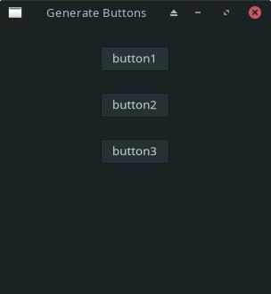

# Multiple Buttons Array using GTK4-rust

This app can generate buttons (arbitrary number) with function on YAML config file.



## How to compile
1. Make sure that git and gnome terminal is installed. To install git in Manjaro 
    ```bash
    sudo pacman -Syu
    sudo pacman -S git
    git --version
    ```
2. To install gnome terminal
    ```bash
    sudo pacman -Syu gnome-terminal
    ```
3. Clone the project repository. This is only a practice repository
    ```bash
    git clone https://github.com/profpoochie/multiple_button_array.git
    ```
4. Change to project root directory
    ```bash
    cd multiple_button_array/
    ```
5. Make the bash script executable
    ```bash
    chmod +x compile_rust_app.sh
    ```
6. Run the bash script
    ```bash
    ./compile_rush_app.sh
    ```
7. Wait for the script to execute. Properly respond to installation prompt.
8. The compilation is finish. You can find the executable file on the project root folder or run the following command
    ```bash
    ./multiple_button_array
    ```

Here is the installation video link: [compiling rust app](https://youtu.be/wMQbYiurzJw "compiling rust app")

### Alternative install
You can use the **compile_rust_app_clean.sh** script to get rid of all the compilation files leaving only the executable file and the YAML config file.

5. Make the bash script executable

    ```bash
    chmod +x compile_rust_app_clean.sh
    ```
6. Run the bash script
    ```bash
    ./compile_rush_app_clean.sh
    ```
